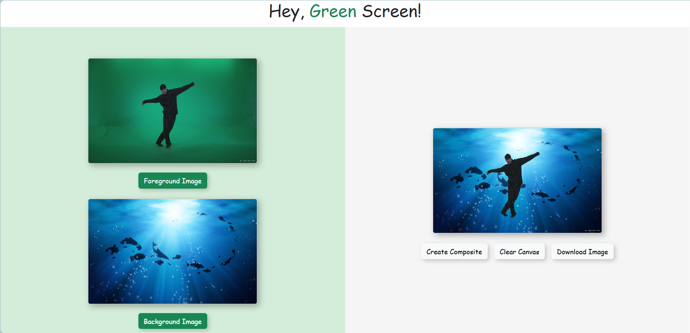

# Green Screen Composer

A simple web-based tool to replace green screens in the foreground image with a selected background using JavaScript.

## Features

- Upload a foreground image with a green screen.
- Upload a background image.
- Automatically detect and replace the green pixels with the background.
- Download the final composite image.

## Demo

See [here](https://XintongWang4869.github.io/green-screen-composer/) for Live Demo.

## Limitations

- The green screen detection threshold may not be suitable for all images.   
    Planned features: customizable sliders for adjusting green sensitivity.
