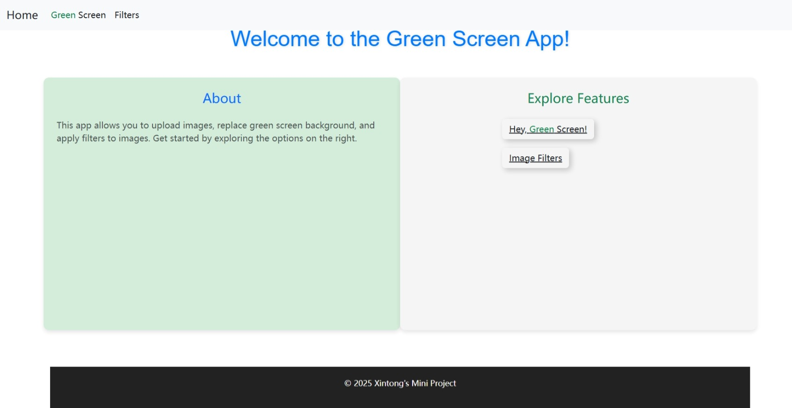
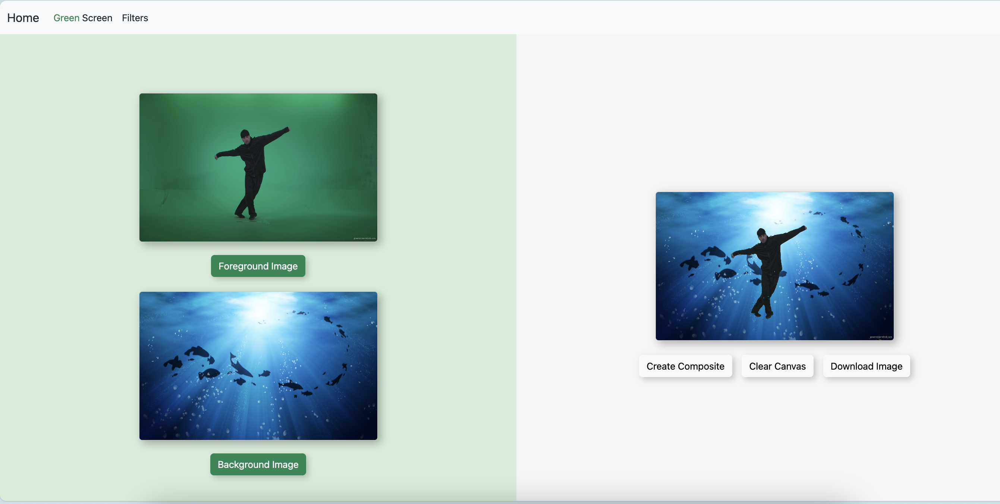
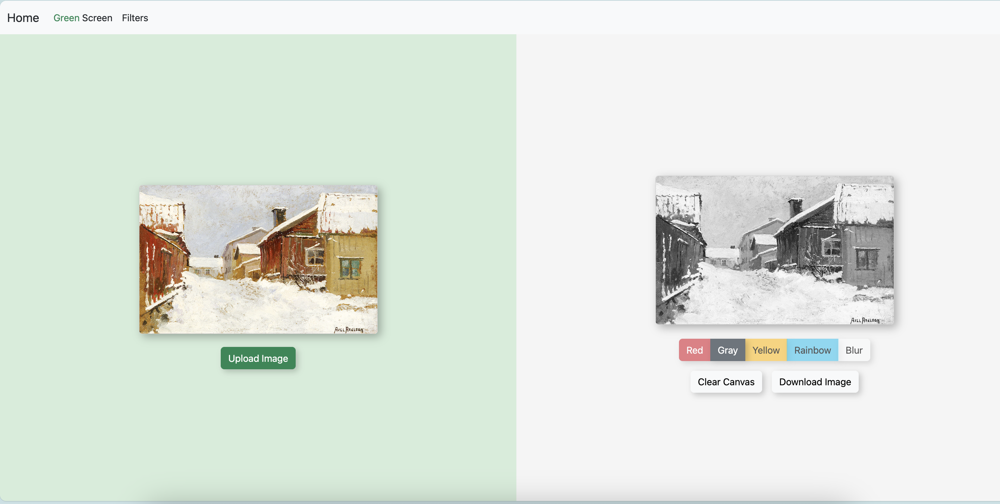

# Green Screen & Image Filter App

A simple web-based tool that allows you to upload images, remove green screen backgrounds, and apply filters to images. This project is built using HTML, CSS, and JavaScript.

## Features

- Green Screen Removal – Replace the green screen background with a custom image.
- Image Filters – Apply various filters to enhance your images. (More filters coming soon!)

## Demo

See [here](https://xintongwang4869.github.io/green-screen-composer/) for Live Demo.    
> Feel free to use sample images in the `assets/images/` directory.

* Index page:   

* Replacing the green screen with your desired image:  

* Making your image gray-scale:  

## Limitations

- The green screen detection threshold may not be suitable for all images.   
    Planned features: customizable sliders for adjusting green sensitivity.
